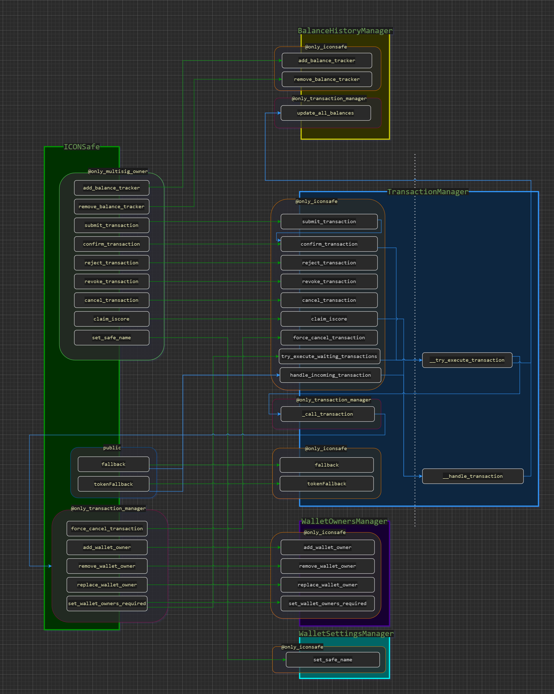

<p align="center">
  
</p>

 [](https://opensource.org/licenses/Apache-2.0)

## Introduction

ICONSafe is a multisig wallet with an advanced user management and built-in features for dApps running on ICON. It is mostly useful for teams willing to share mutual funds without having to risk sharing a same private key between members. 
ICONSafe is able to track tokens balance over time, and send/receive any type of transactions. All outgoing transactions require confirmations from the wallet owners based on a vote before being executed. An outgoing transaction may contain multiple sub-transactions which are executed at the same time, so it is possible to create complex operations suiting for all type of situations.

## Source Code

* GUI : https://github.com/iconsafe/iconsafe.github.io
* SCORE : https://github.com/iconation/ICONSafe-SCORE

## Architecture



## Developers Quick Start

Here is a checklist you will need to follow in order to deploy ICONSafe to the Yeouido testnet:

  * Install prerequisites:
    * `python3 -m venv ./venv && source ./venv/bin/activate`
    * `pip install tbears`
    * `sudo apt install jq`
  * Clone the ICONSafe repository:
    * `git clone https://github.com/iconation/ICONSafe.git && cd ICONSafe`
  * Bootstrap tbears using the `bootstrap_tbears.sh` script located in the tbears folder of the ICONSafe repository
    * `./tbears/bootstrap_tbears.sh`
  * Everytime you want to keep working on this contract, start tbears using the `start_tbears.sh` script located in the tbears folder of the ICONSafe repository
    * `./tbears/start_tbears.sh`
  * Install the operator wallets:
    * In the `config` folder, in each package, you'll find a `./install.sh` file that you can execute.
    * It will generate 3 operator wallets : 
      * A first one on the Yeouido network in `./yeouido/keystores/operator.icx`
      * A second one on the Euljiro network in `./euljiro/keystores/operator.icx`
      * A last one on the Mainnet network in `./mainnet/keystores/operator.icx`
    * Input a password for each network (8 characters with at least 1 number and 1 special character)
  * Send few ICX (20 ICX should be enough) to the Yeouido wallet (the newly generated address is displayed after executing the `install.sh` script)
    * If you don't have some testnet ICX, use the [faucet](http://icon-faucet.ibriz.ai/)
  * Deploy your SCOREs to the testnet:
    * `./scripts/score/deploy_all.sh -n yeouido`
  * Register your SCOREs to the AddressRegistrar in the testnet:
    * `./scripts/score/register_deployed.sh -n yeouido`
  
## Deploy ICONSafe SCORE to localhost, testnet or mainnet

- In the root folder of the project, run the following command:
<pre>./scripts/score/deploy_all.sh</pre>

- It should display the following usage:
```
> Usage:
 `-> ./scripts/score/deploy_all.sh [options]

> Options:
 -n <network> : Network to use (localhost, yeouido, euljiro or mainnet)
```

- Fill the `-n` option corresponding to the network you want to deploy to: `localhost`, `yeouido`, `euljiro` or `mainnet`.
- **Example** : 
<pre>$ ./scripts/score/deploy_all.sh -n localhost</pre>

## Update an already deployed ICONSafe to localhost, testnet or mainnet

- If you modified the ICONSafe SCORE source code, you may need to update it.

- In the root folder of the project, run the following command:
<pre>$ ./scripts/score/update_score.sh</pre>

- It should display the following usage:
```
> Usage:
 `-> ./scripts/score/update_score.sh [options]

> Options:
 -n <network> : Network to use (localhost, yeouido, euljiro or mainnet)
 -p <package> : package to deploy
```

- Fill the `-n` option corresponding to the network where your SCORE is deployed to: `localhost`, `yeouido`, `euljiro` or `mainnet`.
- Fill the `-p` option corresponding to the package you want to update : `address_registrar`, `balance_history_manager`, `event_manager`, `iconsafe`, `transaction_manager`, `wallet_owners_manager`, `wallet_settings_manager`

- **Example** :
<pre>$ ./scripts/score/update_score.sh -n localhost -p iconsafe</pre>
